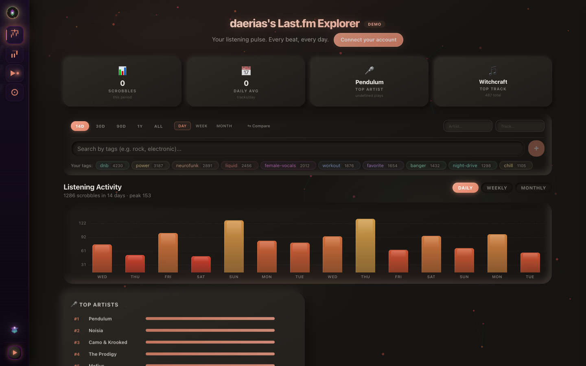
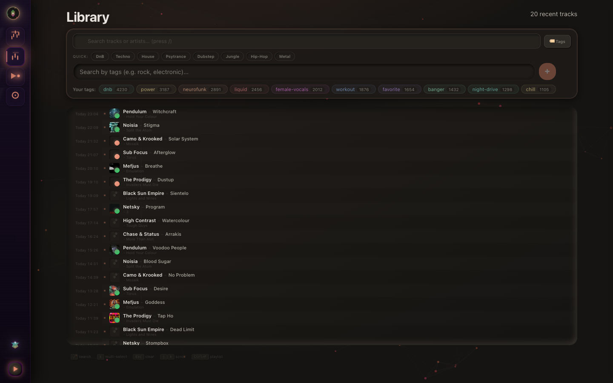
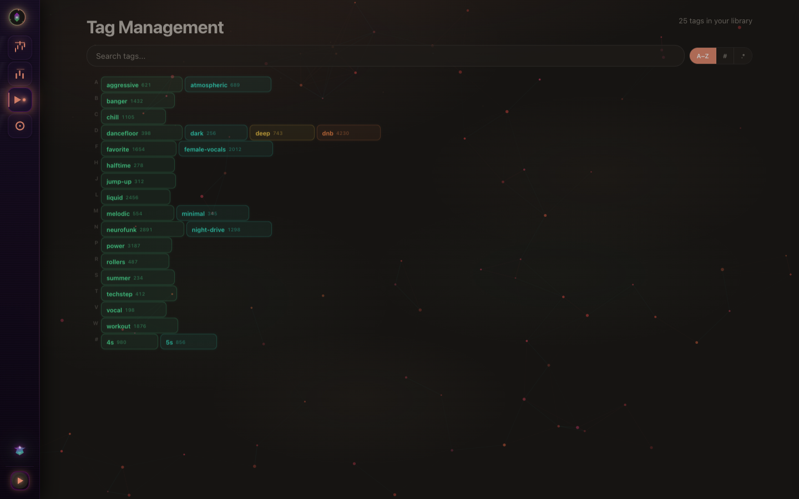
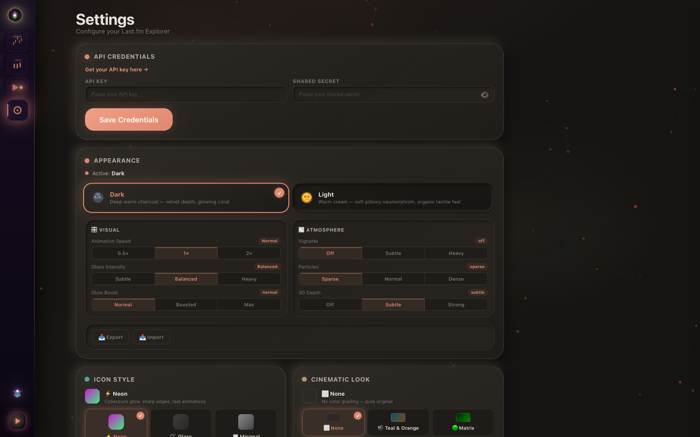

# 🎧 Last.fm Explorer

> **Your listening history, beautifully reimagined.** A premium dual-theme dashboard for Last.fm — discover patterns, manage tags, and explore your music data through a warm plastic-neumorphism interface that feels tactile and alive.

<p align="center">
  
  
  
  
  
</p>

<p align="center">
  
</p>

<p align="center">
  <em>The Home dashboard — interactive listening charts, at-a-glance stats, compare mode, top artists & tracks, genre and tag exploration. Dark theme shown.</em>
</p>

---

## ✨ Features

### 📊 Deep Listening Analytics
- **Interactive listening chart** — day / week / month aggregation with multi-filter system
- **Compare mode** — overlay two date ranges to see how your taste evolves
- **Top artists & top tracks** — computed from your filtered scrobble data in real-time
- **Tag exploration** — drill into any tag to browse tracks, genres, and artists
- **At-a-glance stats** — scrobbles, daily average, top artist, top track — right at the top

### 📚 Library Browser
- **Virtual-scrolling timeline** — browse hundreds of recent scrobbles with zero lag
- **DJ-style quick filters** — 8 genre presets (DnB, Techno, House, Psytrance…), tag chips, full-text search
- **Multi-select bulk tagging** — tag dozens of tracks at once (`x` to enter select mode)
- **Inline track details** — click any track for a slide-over detail panel
- **Cover art** — auto-fetched from multiple sources with fallback chain

<p align="center">
  
</p>

### 🏷️ Tag Management
- **Bulk tag operations** — rename, merge, delete tags globally across all tracks
- **Chip cloud explorer** — browse hundreds of tags grouped by letter
- **Regex search** — find exactly the tags you need
- **Smart suggestions** — autocomplete from your personal tag library

<p align="center">
  
</p>

### 🎵 Music Playback
- **YouTube-first search proxy** — finds free playable sources via HTML parsing (no API key needed)
- **Multi-strategy fallback** — YouTube → alternative sources, always finds something
- **Bottom-docked player** — glass panel that slides up, stays connected to the app
- **Now Playing** — dancing equalizer bars + inline tag editor in the sidebar
- **Playlist Creator** — named playlists, drag-drop, bulk ops, export (TXT/CSV/M3U8), clipboard copy

### 🎨 Premium Design System
- **Dual theme** — 🌚 Dark (warm charcoal, glowing coral) & 🌞 Light (warm cream, soft neumorphism)
- **Plastic neumorphism** — multi-layer warm shadows, specular light sweeps, breathing cards
- **Fine-tune effects** — animation speed, glass intensity, vignette, particles, glow boost, 3D depth
- **Cinematic LUTs** — 8 color grading presets (Teal & Orange, Matrix, Noir, Cyberpunk, Wes Anderson…)
- **7 icon styles** — Neon, Glass, Minimal, Brutal, Retro, Sketch, Chrome — each with fine-tune sliders
- **Depth of Field** — cinematic blur vignette, sharp center, soft edges
- **Calendar heatmap** — GitHub-style grid of your listening density
- **Profile system** — save, load, export, import your theme configurations

<p align="center">
  
</p>

---

## 🚀 Quick Start

```bash
npm install
npm run dev        # → http://localhost:5173
```

### Last.fm Setup

Open the app → **Settings** → enter your [Last.fm API Key](https://www.last.fm/api) and Shared Secret.
Credentials stay in your browser's localStorage — nothing leaves your machine.

### Production Build

```bash
npm run build      # → dist/
```

Deploy the `dist/` folder to Vercel, Netlify, or any static host.

---

## 🛠️ Tech Stack

| Technology | Purpose |
|------------|---------|
| React 19 | UI framework |
| TypeScript 5.7 | Type safety (strict mode) |
| Vite 6 | Build tool + dev server with API proxies |
| React Router 7 | Client-side routing |
| CSS Modules | Scoped component styles |
| Last.fm API v2.0 | Music data + OAuth |
| IndexedDB | Client-side track cache |
| Web Audio API | YouTube proxy for free music playback |

**Zero UI libraries. Zero CSS frameworks.** Every pixel is hand-crafted CSS. CSS-variable-driven theming adapts instantly between light and dark.

---

## 🏗️ Architecture

```
src/
├── main.tsx              # Entry — theme applied before first render
├── App.tsx               # Routes + context providers
├── components/
│   ├── Layout/           # Floating sidebar dock + app shell
│   └── shared/           # Charts, cards, panels, player, tag chips, playlist creator
├── context/              # AuthContext, MusicPlayerContext
├── hooks/                # useCoverFallback, useVirtualScroll, useVimKeys
├── pages/                # Home, Library, Tags, Settings, DayDetail
├── services/             # Last.fm client, cover art search, YouTube search proxy, IndexedDB
├── store/                # Theme (dual light/dark), icon style, cinematic LUTs, credentials
└── styles/               # Design system (theme.css) + icon system (neuro-icons.css)
```

| Route | Page |
|-------|------|
| `/` | **Home** — listening chart, compare mode, stats, top artists & tracks, tag drill-down |
| `/library` | **Library** — virtual-scrolling timeline, genre quick-filters, multi-select bulk tagging |
| `/tags` | **Tags** — manage, rename, delete, regex search, letter-grouped chip cloud |
| `/settings` | **Settings** — credentials, theme toggle, effects fine-tune, icon style, cinematic LUTs |
| `/day/:date` | **Day Detail** — single day's scrobbles with heatmap |

---

## 📄 License

© 2025–2026 Darius Schindler. All rights reserved.

Personal use is free. Commercial use, redistribution, or public hosting requires permission. See [LICENSE](LICENSE).
